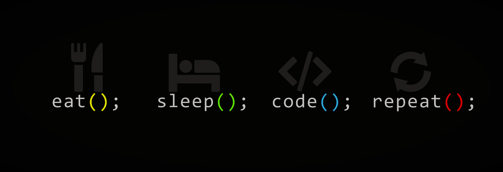

  

  

<h1 align="left">Hi 👋, I'm <a href="https://www.google.com/search?q=Hrithik+Kumar+Singh" target="_blank">Hrithik Kumar Singh</a></h1>
<h3 align="left">A passionate Software developer from India...building scalabe softwares</h3>

<table style="width: 100%;">
  <tr>
    <td style="vertical-align: top; padding: 20px;">
      <ul style="list-style-position: inside; font-size: 16px; line-height: 2;">
        <li>🔭 I’m currently working at: <a href="https://www.tp.com/en-us/"><strong>Teleperformance India</strong></a></li>
        <li>🌱 I’m currently learning: <strong>.NET Core MVC, Azure, DSA</strong></li>
        <li>👯 I’m lazily building: <a href="https://www.google.com/search?q=codersvoice"><strong>Codersvoice</strong></a></li>
        <li>👨‍💻 Checkout the projects and more: <a href="https://hrithik-singh.onrender.com/#projects"><strong>Live Projects</strong></a></li>
        <li>📝 I regularly write articles on: <a href="https://medium.com/@hrithikkumarsingh"><strong>Articles</strong></a></li>
        <li>💬 Ask me about: <strong>Software Development and AI</strong></li>
        <li>📫 How to reach me: <strong>shrithik511@gmail.com</strong></li>
        <li>⚡ Fun fact: <strong>We can Build AI but AI can't build Us...</strong></li>
      </ul>
    </td>
    <td style="text-align: right; vertical-align: top; padding: 20px;">
      
    </td>
  </tr>
</table>

<h3 align="left">Get in touch - Lets connect</h3>

<h3 align="left">Technologies I work on</h3>

  
  
  
  
  
  
  
  
  
  
  
  
  
  
  
  
  
  
  
  
  
  

<h2>Statssssss:</h2>

&nbsp;

<h2>Streaksssssssss:</h2>

<h2>GitHub Trophiesssssss:</h2>

  

<h2 align="center">Want to Support ?</h2>

  

